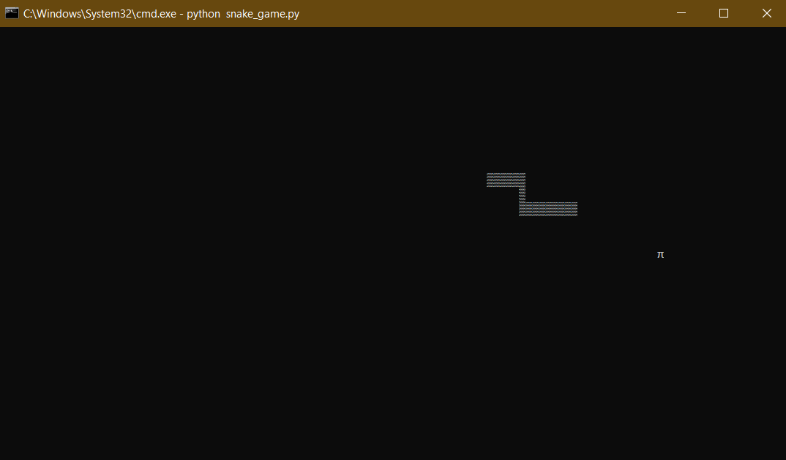

# Snake Game
*A simple snake game made using Python*
## How to Play?
Open console and navigate to the directory where the snake_game.py file is saved and run the following command in console:
```
python snake_game.py
```
## Screenshots

